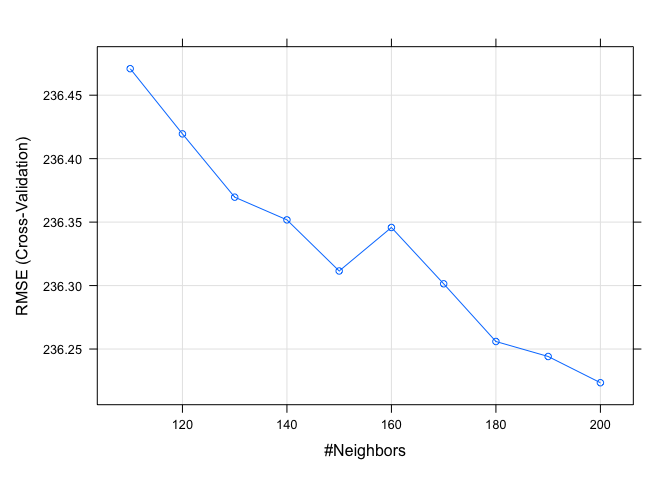
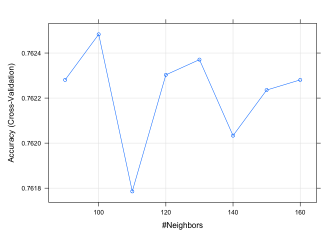
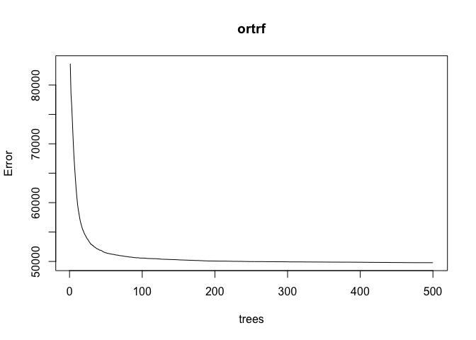

Final project of BST 260 – Analysis of Partial Nephrectomy
================
2022-12-14

**Introduction**  
Partial nephrectomy is a technique widely used when we need to excise
renal tumor without excising the whole kidney. It is extremely valuable
when kidney function preservation is one of our top priority. Common
techniques of partial nephrectomy includes open surgery, laparoscopic
surgery and robotic surgery. With the application of robotic surgery
since 2008, partial nephrectomy is becoming more and more widely
performed. While it is still a very invasive surgery that requires
massive amount of experience, surgeons nowadays are very experienced and
carry out the surgery on a daily basis. Therefore, we try to analyze
what might be the variables associated with the surgical outcomes.

We use PREMIER data base, which is an insurance claim-based database
that provides all of the billable interventions during hospitalization.
The data does not require web scrapping and wrangling. However, most of
the data we have to preprocess in order for us to use.  
For exmple, we make sought through patient medical history by looking at
disease code that is billed and calculate the Charlson comorbidity index
of each patient. We then categorize them into 3 categories, 0, 1, and 2.
Category 0 means Charlson index 0. Category 1 means Charlson index 1 and
2. Category 2 means Charlson index 3 and above.

``` r
library(tableone)
library(reshape2)
library(ggplot2)
library(tidyverse)
```

    ## ── Attaching packages ─────────────────────────────────────── tidyverse 1.3.2 ──
    ## ✔ tibble  3.1.7     ✔ dplyr   1.0.9
    ## ✔ tidyr   1.2.0     ✔ stringr 1.4.0
    ## ✔ readr   2.1.2     ✔ forcats 0.5.1
    ## ✔ purrr   0.3.4     
    ## ── Conflicts ────────────────────────────────────────── tidyverse_conflicts() ──
    ## ✖ dplyr::filter() masks stats::filter()
    ## ✖ dplyr::lag()    masks stats::lag()

``` r
library(haven)
library(quantreg)
```

    ## Loading required package: SparseM
    ## 
    ## Attaching package: 'SparseM'
    ## 
    ## The following object is masked from 'package:base':
    ## 
    ##     backsolve

``` r
library(caret)
```

    ## Loading required package: lattice
    ## 
    ## Attaching package: 'caret'
    ## 
    ## The following object is masked from 'package:purrr':
    ## 
    ##     lift

``` r
library(jpeg)
```

``` r
df<-read_dta("cohort_nephrectomy.dta")
```

``` r
#Clavien-Dindo post operative complication classification has 7 levels, I, II, IIIa, IIIb, IVa, IVb, V
#We dichotomize them into 0 and 1. 0 means I and II, 1 means III and above.
df<-df%>%
  transform(clavien_cat = ifelse(clavien<=1, 0,1))
```

``` r
df$icu<-as.factor(df$icu)
df$obesity<-as.factor(df$obesity)
df$hemostatic<-as.factor(df$hemostatic)
df$hemorrhage<-as.factor(df$hemorrhage)
df$bleeding_cx<-as.factor(df$bleeding_cx)
df$surgical_cx<-as.factor(df$surgical_cx)
df$urology_cx<-as.factor(df$urology_cx)
df$vte_cx<-as.factor(df$vte_cx)
df$readmit_any<-as.factor(df$readmit_any)
df$frailty<-as.factor(df$frailty)
df$tobacco<-as.factor(df$tobacco)
df$prior_tx<-as.factor(df$prior_tx)
df$thrombus<-as.factor(df$thrombus)
df$metastasis<-as.factor(df$metastasis)
df$retro<-as.factor(df$retro)
df$race_cat<-as.factor(df$race_cat)
df$female_yes<-as.factor(df$female_yes)
df$charlson_cat<-as.factor(df$charlson_cat)
df$teaching_yes<-as.factor(df$teaching_yes)
df$urban_yes<-as.factor(df$urban_yes)
df$bed_cat<-as.factor(df$bed_cat)
df$any_comp<-as.factor(df$any_comp)
df$mortality<-as.factor(df$mortality)
df$major_comp2<-as.factor(df$major_comp2)
df$partial<-as.factor(df$partial)
df$surg_approach<-as.factor(df$surg_approach)
df$payor<-as.factor(df$payor)
df$toradol<-as.factor(df$toradol)
df$exparel<-as.factor(df$exparel)
df$clavien_cat<-as.factor(df$clavien_cat)
```

``` r
#Create new variable: dichotomize surgeon volume and hospital volume
#if volume > national median then it is high volume
df<-df %>%
  mutate(nsv = ifelse(surg_vol > median(surg_vol), "1", "0")) %>%
  mutate(nhv = ifelse(hosp_vol > median(hosp_vol), "1", "0")) %>%
  subset(partial == "1") %>%
  subset(!is.na(AGE))
#There are 7 NA in the whole data of 55582 patients. 
#We assume that the missing is completely at random. 
#The missing percentage is very low, we perform complete case analysis. 
#It will barely affect our power. 
```

``` r
df$nhv<-as.factor(df$nhv)
df$nsv<-as.factor(df$nsv)
```

``` r
df1 <- df %>% dplyr::select(AGE, female_yes, race_cat, charlson_cat, payor, or_time, icu, TOT_COSTS_20, readmit_any, hemorrhage, any_comp, nsv, nhv, LOS, morph_total, clavien_cat, surg_approach, year)
#The data from PREMIER database has over 150 variables. 
#After closely examine each variable with our subject knowledge, 
#we pick these above variables to be all of the features that will be used for machine learning.
```

**Variables**  
AGE: age of the patient.  
female_yes: 1 -\> female, 0 -\> male  
race_cat: race of the patient. 1 -\> White, 2 -\> Black, 3 -\> Hispanic,
4 -\> others  
charlson_cat: we take the Charlson comorbidity index and collapsed it
into 3 categories. 0 -\> Charlson comorbidity index 0, 1 -\> charlson
comorbidity index 1 to 2, 2 -\> Charlson comorbidity index greater or
equal to 3.  
payor: the payor of each patient. 1 -\> Medicare, 2-\> Medicaid, 3 -\>
Commercial, 4 -\> Self-pay, 5 -\> others. or_time: operation time, in
minutes.  
icu: admission to ICU, 0 -\> no, 1 -\> yes.  
TOT_COSTS_20: total cost during admission, adjusted to dollar in 2020.  
readmit_any: readmission to urology ward due to surgery related cause in
30 days. 0 -\> no, 1 -\> yes  
henorrhage: intra-operation bleeding that require transfusion. 0 -\> no,
1 -\> yes.  
any_comp: any complication. 0 -\> no, 1 -\> yes.  
nsv: the number of partial nephrectomy the surgeon perform in a year. We
categorize into 0 -\> low volume, the number of partial nephrectomy
performed by this surgeon is less than or equal to national median. 1
-\> high volume.  
nhv: the number of partial nephrectomy the hospital perform in a year.
We categorize into 0 -\> low volume, the number of partial nephrectomy
performed by this hospital is less than or equal to national median. 1
-\> high volume.  
LOS: Length of stay, in days.  
morph_total: total amount of morphine administered for pain control, in
milligrams.  
clavien_cat: we categorized Clavien-Dindo classification of
postoperative complication into 0 -\> Clavien-Dindo classification I or
II. 1 -\> Clavien-Dindo classification greater than or equal to III.  
surg_approach: surgical approach. 0 -\> open surgery, 1 -\>
laparoscopic, 2 -\> robotic surgery.

``` r
#create train test split at 80:20
set.seed(1990) 
index <- sample(nrow(df1), 44460) 
dftrain <- df1[index,] 
dftest <- df1[-index,] 
```

**Linear model**  
First, we use operation time as our surgical outcome. We try to analyze
what are the variables associated with operation time. Since the
operation time is continuous, we use linear model.

``` r
#we will use cross validation in the linear model
train.control <- trainControl(method = "cv", number = 10)
# Train the model
model <- train(or_time ~., data = dftrain, method = "lm",
               trControl = train.control)
# Summarize the results
print(model)
```

    ## Linear Regression 
    ## 
    ## 44460 samples
    ##    17 predictor
    ## 
    ## No pre-processing
    ## Resampling: Cross-Validated (10 fold) 
    ## Summary of sample sizes: 40014, 40014, 40014, 40013, 40015, 40014, ... 
    ## Resampling results:
    ## 
    ##   RMSE      Rsquared    MAE     
    ##   233.5835  0.06690036  169.9445
    ## 
    ## Tuning parameter 'intercept' was held constant at a value of TRUE

``` r
predictions <- model %>% predict(dftest)
data.frame( R2 = R2(predictions, dftest$or_time),
            RMSE = RMSE(predictions, dftest$or_time),
            MAE = MAE(predictions, dftest$or_time))
```

    ##           R2     RMSE      MAE
    ## 1 0.05829596 235.4593 171.6541

We use linear model with 10 fold cross validation. The RMSE in the
training set is 233.58 and RMSE in the test set is 235.46. We can see
that there is no significant overfitting in this model.

**logistic regression**  
We then take a look at Clavien-Dindo category as our surgical outcome.
We want to know what variable might be associated with post operative
complication (Clavien category = 1). Since the outcome is binary, we use
logistic regression with cross validation.

``` r
train_control <- trainControl(method = "cv", number = 10)

# train the model on training set
model <- train(clavien_cat ~ .,
               data = dftrain,
               trControl = train_control,
               method = "glm",
               family=binomial())
```

    ## Warning: glm.fit: fitted probabilities numerically 0 or 1 occurred

    ## Warning: glm.fit: fitted probabilities numerically 0 or 1 occurred

    ## Warning: glm.fit: fitted probabilities numerically 0 or 1 occurred

    ## Warning: glm.fit: fitted probabilities numerically 0 or 1 occurred

    ## Warning: glm.fit: fitted probabilities numerically 0 or 1 occurred

    ## Warning: glm.fit: fitted probabilities numerically 0 or 1 occurred

    ## Warning: glm.fit: fitted probabilities numerically 0 or 1 occurred

    ## Warning: glm.fit: fitted probabilities numerically 0 or 1 occurred

    ## Warning: glm.fit: fitted probabilities numerically 0 or 1 occurred

    ## Warning: glm.fit: fitted probabilities numerically 0 or 1 occurred

``` r
# print cv scores
summary(model)
```

    ## 
    ## Call:
    ## NULL
    ## 
    ## Deviance Residuals: 
    ##     Min       1Q   Median       3Q      Max  
    ## -3.4040   0.0000   0.0000   0.3085   1.9951  
    ## 
    ## Coefficients:
    ##                  Estimate Std. Error z value Pr(>|z|)    
    ## (Intercept)    -6.134e+02  4.477e+05  -0.001  0.99891    
    ## AGE             9.180e-03  1.559e-03   5.887 3.92e-09 ***
    ## female_yes1    -8.887e-02  3.049e-02  -2.915  0.00356 ** 
    ## race_cat2       9.237e-02  4.908e-02   1.882  0.05984 .  
    ## race_cat3      -6.881e-02  6.272e-02  -1.097  0.27256    
    ## race_cat4      -4.458e-02  5.083e-02  -0.877  0.38054    
    ## charlson_cat1   2.517e-01  3.907e-02   6.443 1.17e-10 ***
    ## charlson_cat2   8.299e-01  6.650e-02  12.478  < 2e-16 ***
    ## payor2         -6.539e-03  6.477e-02  -0.101  0.91959    
    ## payor3         -4.138e-02  4.167e-02  -0.993  0.32063    
    ## payor4         -7.975e-02  5.859e-02  -1.361  0.17345    
    ## payor5         -1.475e-01  7.203e-02  -2.048  0.04055 *  
    ## or_time        -2.114e-04  6.460e-05  -3.272  0.00107 ** 
    ## icu1            2.663e-01  5.140e-02   5.180 2.22e-07 ***
    ## TOT_COSTS_20    2.999e-05  2.132e-06  14.067  < 2e-16 ***
    ## readmit_any1    3.829e-01  3.462e-02  11.060  < 2e-16 ***
    ## hemorrhage1     8.289e-01  5.333e-02  15.543  < 2e-16 ***
    ## any_comp1       6.609e+02  4.477e+05   0.001  0.99882    
    ## nsv1           -3.148e-02  3.355e-02  -0.938  0.34804    
    ## nhv1            1.065e-02  3.250e-02   0.328  0.74315    
    ## LOS             2.200e-01  9.185e-03  23.956  < 2e-16 ***
    ## morph_total     2.111e-06  4.181e-06   0.505  0.61361    
    ## surg_approach1  1.651e-01  6.391e-02   2.583  0.00980 ** 
    ## surg_approach2 -8.201e-02  3.657e-02  -2.242  0.02495 *  
    ## year           -2.448e-02  4.434e-03  -5.521 3.37e-08 ***
    ## ---
    ## Signif. codes:  0 '***' 0.001 '**' 0.01 '*' 0.05 '.' 0.1 ' ' 1
    ## 
    ## (Dispersion parameter for binomial family taken to be 1)
    ## 
    ##     Null deviance: 51659  on 44459  degrees of freedom
    ## Residual deviance: 26044  on 44435  degrees of freedom
    ## AIC: 26094
    ## 
    ## Number of Fisher Scoring iterations: 13

``` r
y_hat_logistic <- predict(model, dftest, type="raw") 
cm <- confusionMatrix(y_hat_logistic, dftest$clavien_cat) 
cm$overall["Accuracy"] 
```

    ##  Accuracy 
    ## 0.8436347

in the model we got using logistic regression with 10 fold cross
validation, we can predict our test set with 84.36 percent accuracy. the
model performed quite well.  
We can use these simple models as benchmark to see how machine learning
techniques perform.

**knn**  
We now use knn and repeat previous attempts where we use operation time
and Clavien category as outcomes.

``` r
# your code here
x<-dftrain %>% select(-or_time)
control <- trainControl(method = "cv", number = 10) 
train_knn <- train(x, dftrain[,6],  
                   method = "knn",  
                   tuneGrid = data.frame(k = seq(110,200,10)), 
                   trControl = control) 
train_knn 
```

    ## k-Nearest Neighbors 
    ## 
    ## 44460 samples
    ##    17 predictor
    ## 
    ## No pre-processing
    ## Resampling: Cross-Validated (10 fold) 
    ## Summary of sample sizes: 40014, 40013, 40014, 40014, 40013, 40015, ... 
    ## Resampling results across tuning parameters:
    ## 
    ##   k    RMSE      Rsquared    MAE     
    ##   110  236.4709  0.04264329  173.9798
    ##   120  236.4195  0.04296594  174.0136
    ##   130  236.3697  0.04326331  174.0390
    ##   140  236.3518  0.04334950  174.0824
    ##   150  236.3115  0.04362545  174.0696
    ##   160  236.3458  0.04332166  174.1203
    ##   170  236.3014  0.04364108  174.1367
    ##   180  236.2559  0.04396716  174.1233
    ##   190  236.2441  0.04403309  174.1173
    ##   200  236.2235  0.04417844  174.1027
    ## 
    ## RMSE was used to select the optimal model using the smallest value.
    ## The final value used for the model was k = 200.

``` r
plot(train_knn)
```

<!-- -->

After tuning our knn model we can see that when k=190 we have the
smallest RMSE in the training set. We then proceed to the test set.

``` r
predictions1 <- train_knn %>% predict(dftest)
data.frame( R2 = R2(predictions1, dftest$or_time),
            RMSE = RMSE(predictions1, dftest$or_time),
            MAE = MAE(predictions1, dftest$or_time))
```

    ##           R2     RMSE      MAE
    ## 1 0.04072106 237.6369 175.4204

In our test, the RMSE is 237.64, compared to our training set 236.22,
there is not much overfitting happening.\\ However, if we compare to the
RMSE we get in the test set from the linear model, which is 235.46, we
can see that our knn model performed not as good as linear model.

``` r
# your code here
x1<-dftrain %>% select(-clavien_cat)
control <- trainControl(method = "cv", number = 10) 
train_knn1 <- train(x, dftrain[,16],  
                   method = "knn",  
                   tuneGrid = data.frame(k = seq(90,160,10)), 
                   trControl = control) 
train_knn1 
```

    ## k-Nearest Neighbors 
    ## 
    ## 44460 samples
    ##    17 predictor
    ##     2 classes: '0', '1' 
    ## 
    ## No pre-processing
    ## Resampling: Cross-Validated (10 fold) 
    ## Summary of sample sizes: 40014, 40013, 40014, 40014, 40014, 40013, ... 
    ## Resampling results across tuning parameters:
    ## 
    ##   k    Accuracy   Kappa    
    ##    90  0.7622807  0.2351410
    ##   100  0.7624831  0.2352493
    ##   110  0.7617858  0.2329444
    ##   120  0.7623031  0.2344704
    ##   130  0.7623707  0.2351192
    ##   140  0.7620332  0.2342221
    ##   150  0.7622356  0.2343273
    ##   160  0.7622808  0.2343989
    ## 
    ## Accuracy was used to select the optimal model using the largest value.
    ## The final value used for the model was k = 100.

``` r
plot(train_knn1)
```

<!-- -->

``` r
y_hat_knn <- predict(train_knn1, dftest, type="raw") 
cm <- confusionMatrix(y_hat_knn, dftest$clavien_cat) 
cm$overall["Accuracy"] 
```

    ##  Accuracy 
    ## 0.7565452

The accuracy in our training set is 76.25 percent. The accuracy in our
test set is 75.65 percent. There is not much overfitting happening here.
However, if we compare to our logistic regression model, which has
accuracy of 84.36 percent in the test set, knn model does not perform as
good as the logistic regression model.

**Random forest**  
We repeat the above tasks with random forest technique.

``` r
library(randomForest)
```

    ## randomForest 4.7-1.1

    ## Type rfNews() to see new features/changes/bug fixes.

    ## 
    ## Attaching package: 'randomForest'

    ## The following object is masked from 'package:dplyr':
    ## 
    ##     combine

    ## The following object is masked from 'package:ggplot2':
    ## 
    ##     margin

``` r
ortrf <- randomForest(or_time ~ ., data = dftrain, mtry = 3,
                         importance = TRUE, na.action = na.omit)
ortrf
```

    ## 
    ## Call:
    ##  randomForest(formula = or_time ~ ., data = dftrain, mtry = 3,      importance = TRUE, na.action = na.omit) 
    ##                Type of random forest: regression
    ##                      Number of trees: 500
    ## No. of variables tried at each split: 3
    ## 
    ##           Mean of squared residuals: 49792.31
    ##                     % Var explained: 14.68

``` r
plot(ortrf)
```

<!-- -->

``` r
RMSE<-sqrt(min(ortrf$mse))
RMSE
```

    ## [1] 223.135

The RMSE in the training set is 222.97

``` r
rfPredict <- predict(ortrf,newdata = dftest )
```

``` r
head(data.frame(dftest$or_time, rfPredict))
```

    ##     dftest.or_time rfPredict
    ## 34             400  309.1177
    ## 48             240  230.0741
    ## 52             264  239.6602
    ## 89             291  292.0544
    ## 112            275  290.2058
    ## 161            210  206.9128

``` r
mse = mean((dftest$or_time - rfPredict)^2)
mae = caret::MAE(dftest$or_time, rfPredict)
rmse = caret::RMSE(dftest$or_time, rfPredict)

cat("MSE: ", mse, "MAE: ", mae, " RMSE: ", rmse)
```

    ## MSE:  50405.38 MAE:  162.4935  RMSE:  224.5114

The RMSE in the test set is 224.52. It is bigger than the RMSE in the
training set, which has RMSE of 222.97, but not by too much. We can say
that there is no overfitting happening here. The RMSE in the test set is
significantly smaller than the RMSE we got from both linear model with
10 fold cross validation and knn model. We concluded that in the
prediction of operation time of partial nephrectomy using the PREMIER
database, the random forest method has the best performance. Linear
model with 10 fold cross validation performance comes in second. The
performance of knn model is the worst.

We now try the random forest method in the analysis where Clavien
category is the outcome.

``` r
clcrf <- randomForest(clavien_cat ~ ., data = dftrain, mtry = 3,
                         importance = TRUE, na.action = na.omit)
clcrf
```

    ## 
    ## Call:
    ##  randomForest(formula = clavien_cat ~ ., data = dftrain, mtry = 3,      importance = TRUE, na.action = na.omit) 
    ##                Type of random forest: classification
    ##                      Number of trees: 500
    ## No. of variables tried at each split: 3
    ## 
    ##         OOB estimate of  error rate: 16.06%
    ## Confusion matrix:
    ##       0    1 class.error
    ## 0 29536 3022  0.09281897
    ## 1  4118 7784  0.34599227

``` r
plot(clcrf)
```

<!-- -->

``` r
y_hat_rfc <- predict(clcrf,newdata = dftest ) 
cm <- confusionMatrix(y_hat_rfc, dftest$clavien_cat) 
cm$overall["Accuracy"] 
```

    ##  Accuracy 
    ## 0.8445344

In the training set, we get the out of bag error rate 16.1 percent. the
accuracy is 83.9 percent. In the test set, our model has an accuracy of
84.5 percent. There is no overfitting happening here. In conclusion we
can see that in the task of predicting post operative complication
Clavien-Dindo category by using the PREMIER data base, the performance
of random forest is slightly better than logistic regression with 10
fold cross validation. The knn model performed the worst.

**Conclusion** We developed prediction models for operation time and
post operative complication by using PREMIER data base. We created 3
different models for these 2 different outcomes respectively. The models
performed well and did not overfit. The model is potentially useful in
the surgeon patient communication and preoperative patient education.
